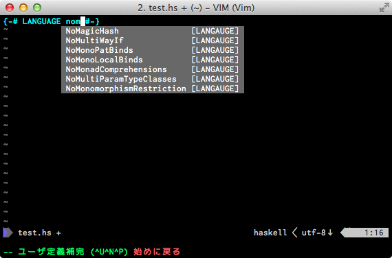
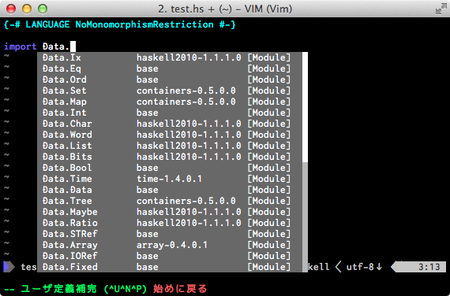
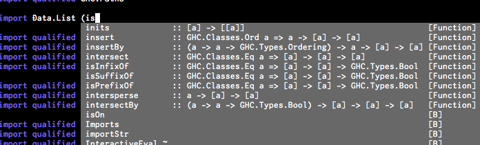
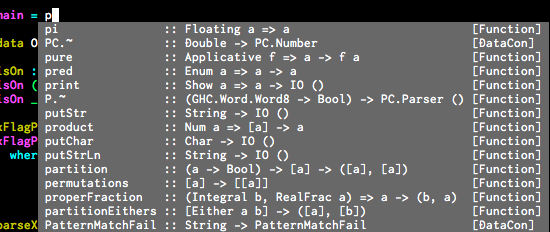
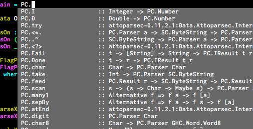
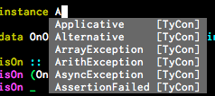

hassistant.vim
==============

Haskell completion function for vim using neocomplete.

features
==============
* using shared library
* robust completion
* display type

screenshots
==============

LANGUAGE Pragma
------------


module name
------------


function in module
--------------


function
--------------


qualified function
--------------


type
--------------


installation
==============

NeoBundle
```.vim
NeoBundle 'philopon/hassistant.vim', { 'build' : {'mac' : 'sh build.sh'} }
```

TODO
==============
* read package by PackageImports
* cabal
* type check

