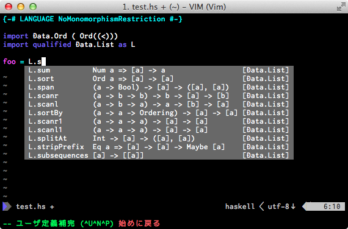
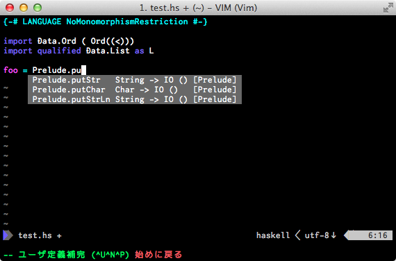

hassistant.vim
==============

Haskell completion function for vim using neocomplete.

features
==============
* using shared library
* robust completion
* display type

require
==============
* Shougo/vimproc.vim
* Shougo/neocomplete.vim

installation
==============
```.vim
NeoBundle 'philopon/hassistant.vim', 
      \ { 'build'  : { 'mac' : 'sh build.sh'
      \              , 'unix': 'sh build.sh' 
      \              }
      \ , 'depends': 'Shougo/vimproc' 
      \ }
```

screenshots
==============

completion
-----------

### LANGUAGE


### module
module name


names in module


names in constructor


### Names
unqualified


qualified as



qualified



type display
--------------

